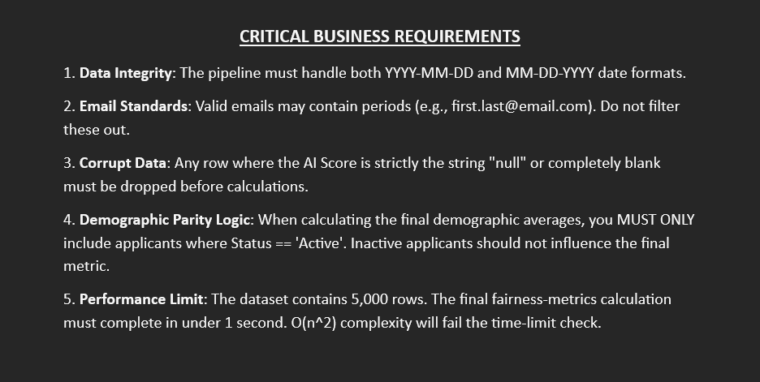

# 💻 CRACK THE CODEBASE: HR Analytics Pipeline

Welcome to the ultimate debugging challenge! 

You have been handed a broken, messy software pipeline designed for an HR company. The previous developer left the company before finishing it. Your job is to fix the syntax errors, resolve the logical bugs, and optimize the performance.

## 🚀 Setup Instructions
1. Clone this repository to your Lab PC.
2. Ensure you have Python 3.8+ installed.
3. Your entry point is `main.py`. Run it, read the errors, and start debugging!

## 🎯 The Objective
When fully functioning, the pipeline should:
1. Load the `dataset.csv` file.
2. Clean the messy data inside `data_cleaner.py`.
3. Calculate demographic parity inside `fairness_metrics.py`.
4. Save the final dictionary to a text file using `report_generator.py`.

## ⚠️ Pipeline Requirements
The previous developer ignored several critical business rules. You must ensure your fixed code adheres to the logic below. Failure to do so will result in the wrong final output.

## 🏆 Evaluation Criteria
You will be judged on:
* **Functionality:** Does the program run from start to finish without crashing?
* **Accuracy:** Does it output the correct demographic averages?
* **Performance:** Did you fix the severe algorithmic bottleneck?
* **Readability:** Did you rename the terrible variables and refactor the code?

Good luck, and happy debugging!
